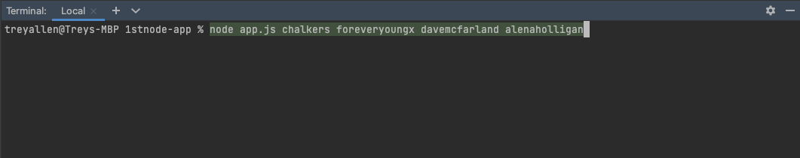
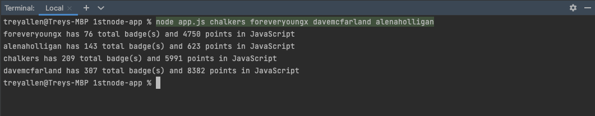

# Node Command Line Search
> This is an app built to use the Treehouse.com api and search for a user's username it displays their total amount of badges and points
> Live demo [_here_](https://replit.com/@Foreveryoungx/Node-Command-Line-search#index.js). use shell  <!-- If you have the project hosted somewhere, include the link here. -->

## Table of Contents
* [General Info](#general-information)
* [Technologies Used](#technologies-used)
* [Features](#features)
* [Screenshots](#screenshots)
* [Setup](#setup)
* [Usage](#usage)
* [Project Status](#project-status)
* [Room for Improvement](#room-for-improvement)
* [Acknowledgements](#acknowledgements)
* [Contact](#contact)
<!-- * [License](#license) -->

 
## General Information
- Intro into learning how to create a full on nodeJS application
- Attempting to learn fundamentals of Node.js with first project

## Technologies Used
- Node - version 14.15.5

## Screenshots
- Running node app with username arguments

- output of executing Node app

## Setup
1. Make sure latest version of Node is installed
2. After download run command `npm install`
3. setup complete

## Usage
How does one go about using it?
Provide various use cases and code examples here.

1. use `node app.js` to prepare to execute app
2. input argument in the command line of a username form Treehouse ex.`foreveryoungx`
3. for multiple usernames put space between arguments ex. `foreveryoungx chalkers davemcfarland`
4. hit enter and view results 

## Project Status
Project is: _in progress_ / _complete_ 

## Room for Improvement
- adding error Handling to verify incorrect usernames

Room for improvement:
- Error Handling

To do:
- Error Handling

## Acknowledgements
Give credit here.
- This project was inspired by... Andrew Chalkley at Treehouse

## Contact
Created by [@foreveryoungx](https://github.com/Foreveryoungx) - feel free to contact me!
[Trey Allen](https://www.linkedin.com/in/trevon-allen-66b2a9a7/)